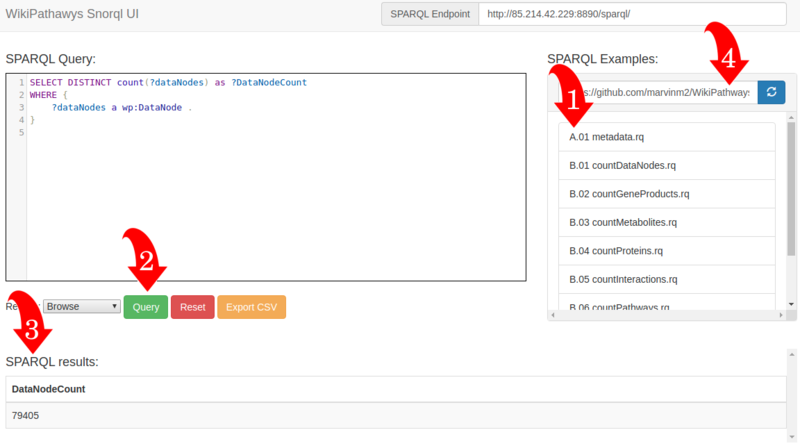

## Summary 
---------
Plant Metabolic Pathways Wiki (PlantMetWiki) is an open online portal for querying linked specialized plant pathway information. PlantMetWiki is available in **Semantic Web format** as Resource Description Framework (**RDF**) and can be accessed via an easy-to-use **SNORQL user interface**. **Pre-written SPARQL queries** are available for users to execute or adapt to retrieve pathway information. **Federated queries** with other linked open data tools are supported, thereby expanding the [Wikidata](https://www.wikidata.org/wiki/Wikidata:Main_Page) framework. 

By structuring characterized pathways knowledge as Linked Open Data, linking it to predicted biosynthetic clusters, and supporting federated querying, PlantMetWiki supports **hypothesis generation in plant biosynthesis and natural product discovery**. 

## Using the SPARQL Explorer 
---------

Visit our PlantMetWiki SPARQL interface at [plantmetwiki.bioinformatics.nl](https://plantmetwiki.bioinformatics.nl/). 

Follow the steps below to execute a pre-written query: 

1: **Select a query** from the list of example SPARQL queries. You can **adapt the query** by typing in the SPARQL Query box or from the source repository [pathway-lod/SPARQLQueries](https://github.com/pathway-lod/SPARQLQueries) 

2: Press the green **Query** button to execute your selected query. 

3: View the **result s** on the same page. 

4: You can **select your own** list of example queries from github, by adding the link and click the **refresh button**.  

  

* Update your SPARQL query from [this template]({{ "/ParticipantQueries/Example1/" | relative_url }})

## Download Results 
---------

Output data is available for download in native RDF format (.ttl), TSV, CSV, and json. 

## Use Cases
---------
### 1. Diving into Natural Products : and example from castor oil 
---------

### 2. Resolving Pathways across Species : an example in Capsicum 
---------

## Tutorial Pages : the SPARQL PlantMetWiki Explorer 
---------




* [{{ p.title }}]({{ p.url | relative_url }})


## Resources
---------

* [Introduction to RDF and SPARQL](/Presentation_introRDF.pdf) by BiGCaT Maastricht University

* Wikipathway ontology [The WikiPathways WP Ontology](https://vocabularies.wikipathways.org/)

* [Guide to WikiPathways SPARQL Queries](https://www.wikipathways.org/sparql.html)

* [The WikiPathways Semantic Web Portal](https://classic.wikipathways.org/index.php/Portal:Semantic_Web)

## PlantMetWiki architecture 
---------

PlantMetWiki is built as a modular Linked Open Data ecosystem.
The following repositories together form the data pipeline, infrastructure,
user interfaces, and documentation of the project:

* **Cyc_to_wiki** – Data extraction and preparation from pathway databases  
  <https://github.com/pathway-lod/Cyc_to_wiki>

* **gpml-to-rdf** – Conversion of GPML pathway files into RDF  
  <https://github.com/pathway-lod/gpml-to-rdf>

* **map-to-rdf** – Generation of RDF crosslinks with MIBiG and plantiSMASH  
  <https://github.com/pathway-lod/map-to-rdf>

* **virtuoso-httpd-docker** – Triple store setup and Dockerized deployment of the PlantMetWiki SPARQL endpoint  
  <https://github.com/pathway-lod/virtuoso-httpd-docker>

* **Snorql-UI** – Web-based SPARQL query interface for PlantMetWiki  
  <https://github.com/pathway-lod/Snorql-UI>

* **SPARQLQueries** – Curated example SPARQL queries for PlantMetWiki and federated endpoints  
  <https://github.com/pathway-lod/SPARQLQueries>

* **SPARQLTutorials** – Documentation and tutorial pages for learning how to query PlantMetWiki (this website)  
  <https://github.com/pathway-lod/SPARQLTutorials>

## Data availability 
---------

Data related to PlantMetWiki is available at [Zenodo PlantMetWiki Community](https://zenodo.org/communities/plantmetwiki/). 